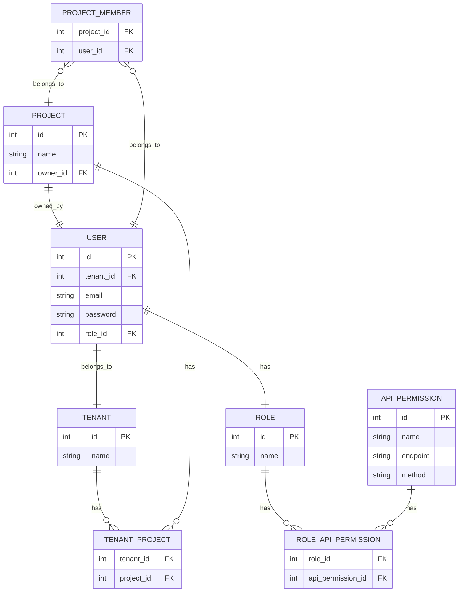

# nota
nota backend engineer position assignment project

# ERD

# API 명세
## 사용자 인증(Authentication)
|메서드|엔드포인트|설명|
|---|---|---|
|POST|/users|회원가입 (이메일 인증 포함)|
|POST|/users/email-verifications|이메일 인증 코드 확인|
|POST|/auth/tokens|로그인 (JWT 발급)|
|POST|/users/password-reset-requests|비밀번호 재설정 요청 (이메일 발송)|
|POST|/users/passwords|비밀번호 재설정|
## 역할(Role) 및 권한(Permission) 관리
|메서드|엔드포인트|설명|
|---|---|---|
|GET|/roles|역할 목록 조회|
|POST|/roles|새로운 역할 생성 (관리자)|
|POST|/roles/{role_id}/permissions|역할에 API 권한 추가|
|DELETE|/roles/{role_id}/permissions/{permission_id}|역할에서 API 권한 제거|
## 프로젝트(Project) 관리
|메서드|엔드포인트|설명|
|---|---|---|
|POST|/projects|프로젝트 생성|
|GET|/projects|프로젝트 전체 조회|
|GET|/projects/{project_id}|프로젝트 상세 조회|
|PATCH|/projects/{project_id}|프로젝트 수정 (소유자만 가능)|
|DELETE|/projects/{project_id}|프로젝트 삭제 (소유자만 가능)|
## 프로젝트 팀원 초대 및 역할 부여
|메서드|엔드포인트|설명|
|---|---|---|
|POST|/projects/{project_id}/members|프로젝트 팀원 추가|
|DELETE|/projects/{project_id}/members/{user_id}|프로젝트 팀원 제거|
