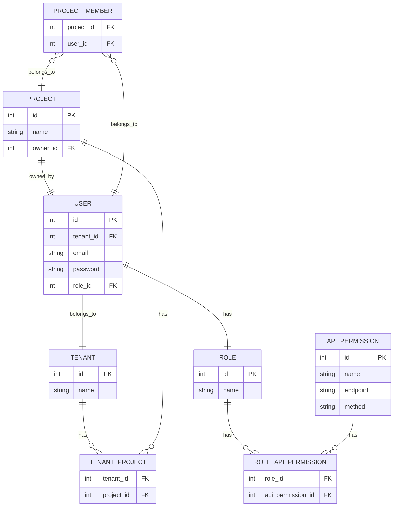

# nota
nota backend engineer position assignment project

# ERD

```mermaid
erDiagram

    %% 사용자 테이블
    USER {
        int id PK
        int tenant_id FK
        string email
        string password
        int role_id FK
    }

    %% 역할 테이블
    ROLE {
        int id PK
        string name
    }

    %% API 권한 테이블
    API_PERMISSION {
        int id PK
        string name
        string endpoint
        string method
    }

    %% 역할-API 권한 연결 테이블 (다대다 관계 해결)
    ROLE_API_PERMISSION {
        int role_id FK
        int api_permission_id FK
    }

    %% 테넌트(조직) 테이블
    TENANT {
        int id PK
        string name
    }

    %% 프로젝트 테이블
    PROJECT {
        int id PK
        string name
        int owner_id FK
    }

    %% 테넌트-프로젝트 다대다 관계 해결 테이블
    TENANT_PROJECT {
        int tenant_id FK
        int project_id FK
    }

    %% 프로젝트 팀원 테이블 (role_id 제거)
    PROJECT_MEMBER {
        int project_id FK
        int user_id FK
    }

    %% 관계 설정
    USER ||--|| TENANT : belongs_to
    USER ||--|| ROLE : has
    ROLE ||--o{ ROLE_API_PERMISSION : has
    API_PERMISSION ||--o{ ROLE_API_PERMISSION : has
    PROJECT ||--|| USER : owned_by
    PROJECT_MEMBER }o--|| PROJECT : belongs_to
    PROJECT_MEMBER }o--|| USER : belongs_to
    TENANT ||--o{ TENANT_PROJECT : has
    PROJECT ||--o{ TENANT_PROJECT : has

```
